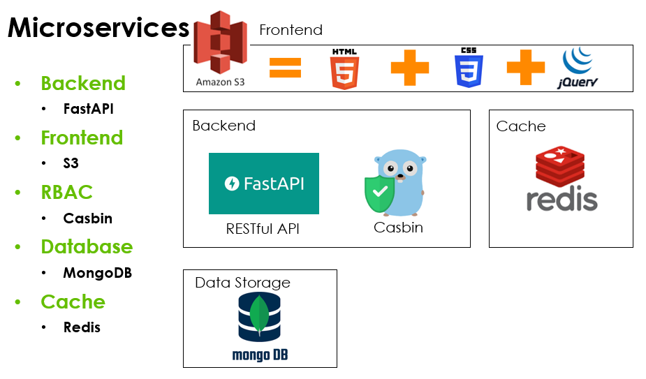
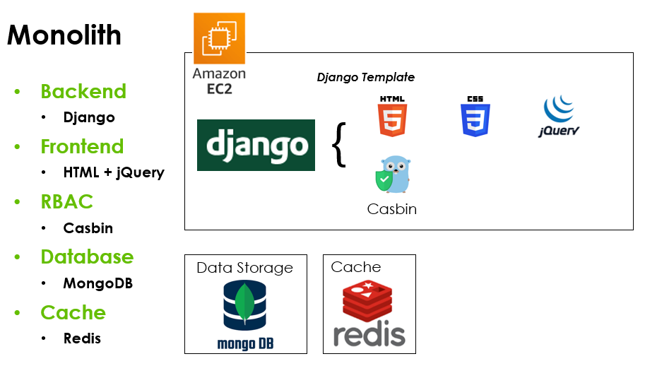

# Project Description

This project is trying to build RBAC (Role-Based Access Control) feature with fastAPI and Casbin, which will be a selected solution combination for the Operation Tool System for Zyxel Nebula Platform.

## Build up the environment

1. Go to the project folder in command line and run the below command:

    ```.sh
   source ./init.sh
    ```

   This will install the necessary libs, setup the venv, and activate it.

2. Initiate the project

   ```.sh
   fastapi dev main.py
   ```

   or

   ```.sh
   uvicorn main:app --reload
   ```

Go to <http://127.0.0.1:8000/docs> to test and send HTTP request with FastAPI provided swagger UI.

## OP Tool Design

### Features

1. Role Management

   - Only Admin user can see this page

   - Admin user can adjust other users' group or role

2. Remote Device Access (SSH)
  
   - Only Admin and user have access to this feature

   - This behavior needs approval  

3. Email Communication (Sending emails)
  
   - Only Admin and user have access to this feature

   - This behavior needs approval

4. Org/Site/Device Management

   - No limitations to this feature

5. Firmware Management

   - Firmware Integrity Check1j6

      - No limitation to this page

   - Firmware Update to Site/Device

      - This behavior needs approval

6. Auditing

   - Only Administrator and Developer can see this page

7. Announcement Management

   - Only Administrator and User can access to this feature

   - This behavior needs approval

8. Approval Pending

   - Only Administrator can access this page

9. Org Owner Management

   - Only Administrator and User can see this page

   - This behavior need approval

10. Trial License Extension

   - Only Administrator and User can see this page

   - This behavior needs approval

11. Generate OpenAPI Key

   - Only Administrator and User can see this page

   - This behavior needs approval

### Roles

1. Administrator

2. Developer

3. User

### Feature - Role Relationship

✓ - Allowed &nbsp;&nbsp; ! - Need Approval &nbsp;&nbsp; X - No Permission

| Feature                  | Administrator | Developer   | User        |
|--------------------------|---------------|-------------|-------------|
| Role Management          | ✓             | X           | X           |
| Remote Device Access     | ✓             | X           | !           |
| Email Communication      | ✓             | X           | !           |
| Organization Management  | ✓             | ✓           | ✓           |
| Firmware Management      | ✓             | ✓!          | ✓!          |
| Auditing                 | ✓             | ✓           | X           |
| Announcement Management  | ✓             | X           | !           |
| Approval Pending         | ✓             | X           | X           |
| Org Owner Management     | ✓             | X           | !           |
| Trial License Extension  | ✓             | X           | !           |
| Generate OpenAPI Key     | ✓             | X           | !           |

### System design

Considering the fact that OP Tool is an internal tool without massive usage or peak moments, here are two proposals for the tools and system structure.

1. Microservices
  
   - Backend: FastAPI

   - Frontend: S3 hosts static HTML page

   - RBAC: Casbin

   - Database: MongoDB

   - Cache: Redis

   

2. Monolith

   - Backend: Django

   - Frontend: Django Template

   - RBAC: Casbin

   - Database: MongoDB

   - Cache: Redis

   

### Library

1. FastAPI (<https://fastapi.tiangolo.com/>)

2. Casbin (<https://casbin.org/docs/get-started>)
